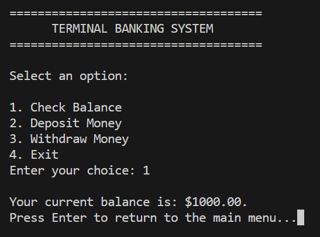
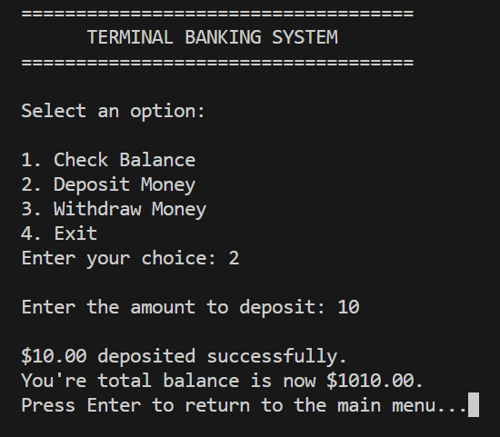
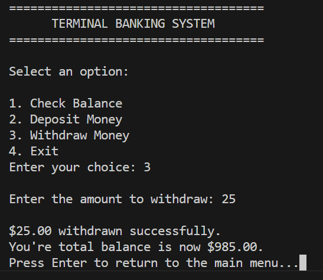
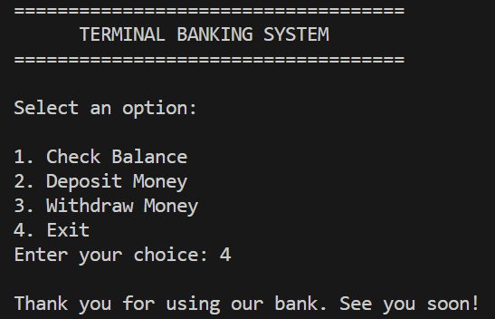

  

# 🏦 Project 9 – Terminal Banking System (in C)

Welcome to **Project 9** in this beginner-friendly C programming mini-series! This project is a simple terminal-based **banking system** where the user can check their balance, deposit, or withdraw money using an interactive menu.

It’s a great way to practice real-world logic, input validation, formatted output, and file handling.

---

## 📌 About this project

This mini project simulates a basic banking experience in the terminal. Here's what it does:

- Displays a banking banner
- Shows a menu with the following options:
  1. Check Balance
  2. Deposit Money
  3. Withdraw Money
  4. Exit the program
- Asks the user to choose an operation
- Performs balance updates (deposit/withdraw)
- Displays feedback and formatted output
- Keeps the program running until the user exits

---

## 🧪 Example Output

📎 Here's a preview of what the terminal output looks like:

---

## 📁 ASCII Art File

The header banner is displayed from this text file:

- 📄 `src/bank_banner.txt`

You can customize the look of the program by editing this file.

---

## ✍️ How to build it yourself

If you'd like to recreate this project from scratch, follow this general outline:

1. **Add a welcome banner**  
   Display an ASCII art title screen using a `.txt` file and `fopen()` + `fgets()`.

2. **Show a menu with 4 options**  
   Prompt the user to choose:
   - 1 → Check Balance  
   - 2 → Deposit  
   - 3 → Withdraw  
   - 4 → Exit

3. **Validate user input**  
   Make sure the user enters a valid number between 1 and 4.

4. **Implement each operation**  
   - `Check Balance`: show current balance.
   - `Deposit`: ask for an amount and update balance.
   - `Withdraw`: prompt the user for an amount to withdraw from the account. If it's less than or equal to the current balance, deduct it and show the updated balance. Otherwise, display an error message indicating insufficient funds.

5. **Display the result**  
   Use `printf` to format and show the updated balance.

6. **Loop back to menu**  
   After each operation, Wait for the user to press Enter before showing the menu again.

7. **Exit gracefully**  
   If the user selects 4, print a thank-you message and end the program.

---

Happy coding! 🚀
